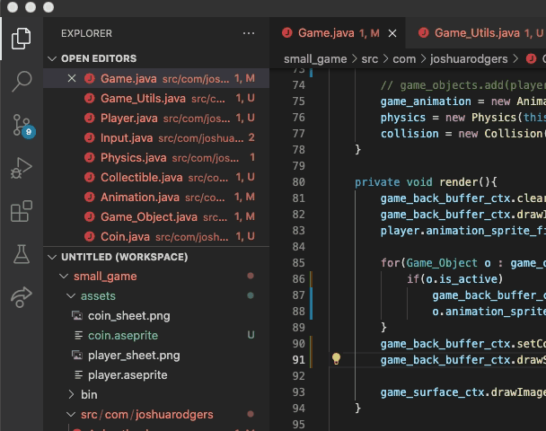

# small_game
making a small top down 2d game with animated sprites from scratch in Java 

i'm thinking of turning this into a little dungeon crawler. just practicing thinking
out the various aspects of a 2d game world; a map and rooms are the obvious next step.

